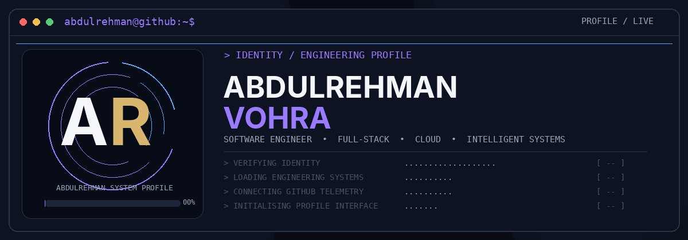
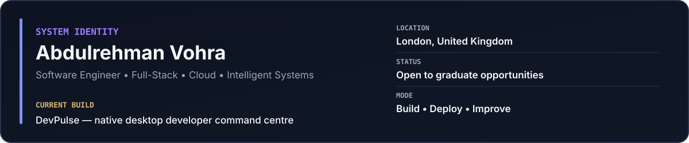
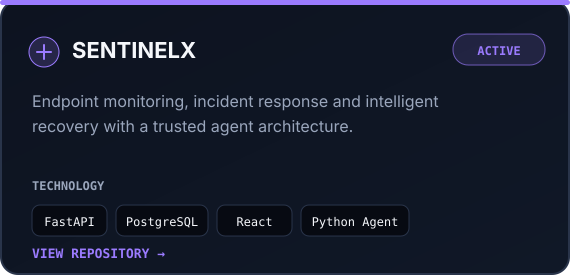
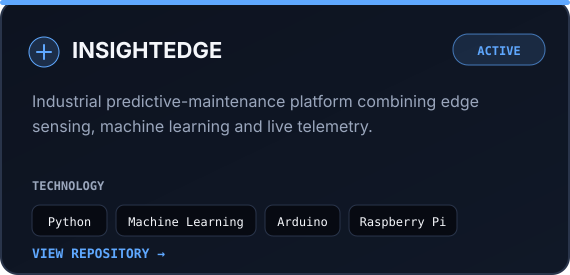
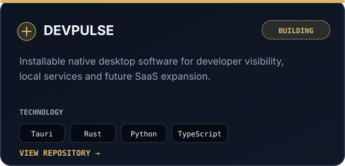
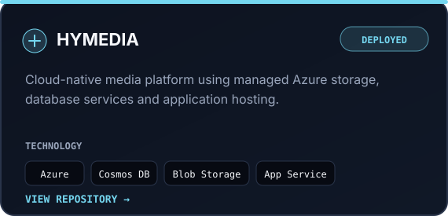
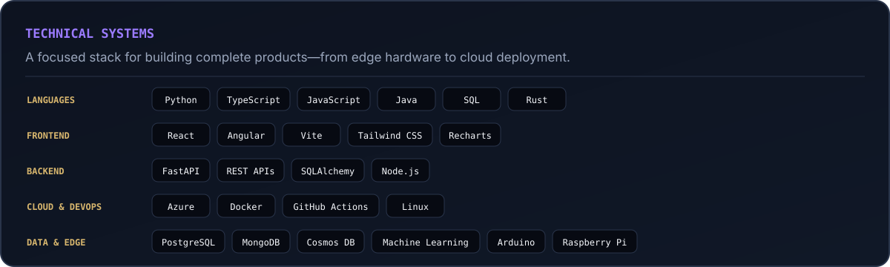
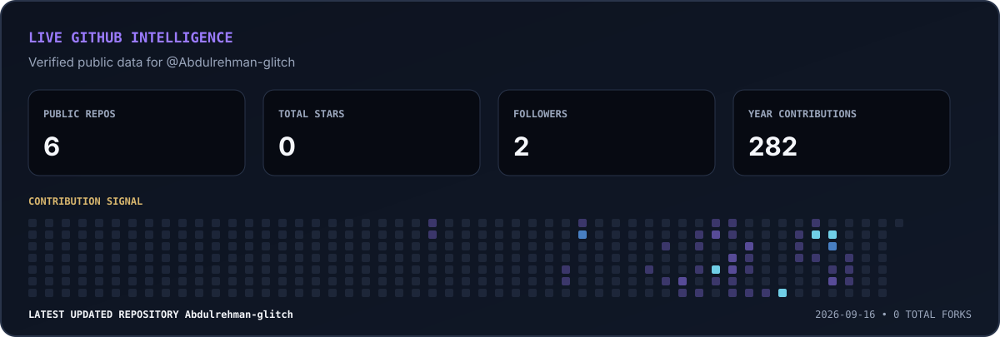
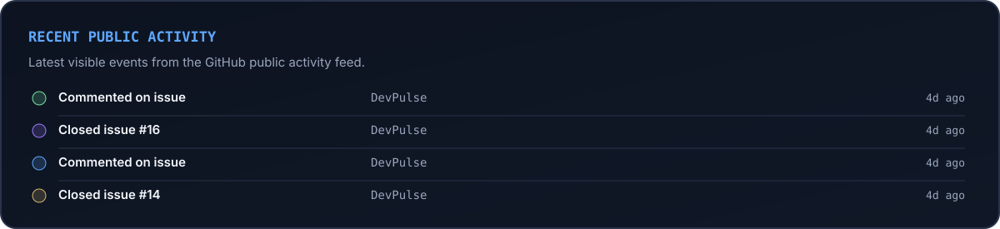
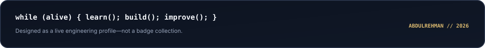

 

 

## Featured systems

<table>
<tr>
<td width="50%">

</td>
<td width="50%">

</td>
</tr>
<tr>
<td width="50%">

</td>
<td width="50%">

</td>
</tr>
</table>

## Technical systems

 

## Live GitHub intelligence

 

### Connect

[LinkedIn](ADD_YOUR_LINKEDIN_URL) · [Email](mailto:ADD_YOUR_EMAIL) · [Repositories](https://github.com/Abdulrehman-glitch?tab=repositories)

 

